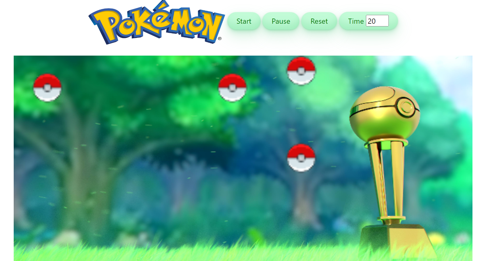

<!-- PROJECT LOGO -->
## Pokemon Game in JS
A design game which shows Pokeballs all over the screen and when two of them are colliding they explode.
There is an ability to set maximum time for the game and ability to pause and reset the game.
The game is over when all Pokeballs exploded or the time is up.

### Built With
* JavaScript
* HTML
* CSS

