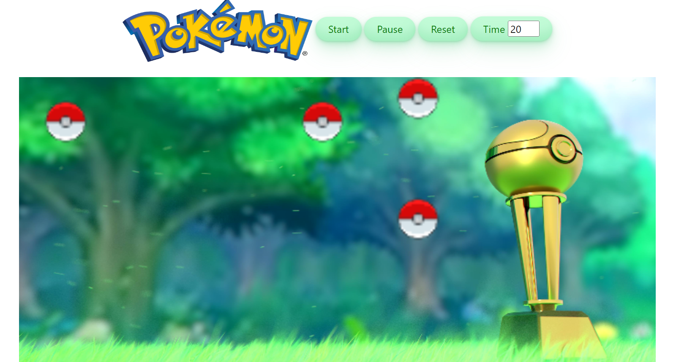

<!-- PROJECT LOGO -->
## Pokeball Game in JS
A designed game which shows Pokeballs all over the screen and when two of them are colliding they explode.

### The Game Features
* Support responsive design
* User can pause and resume the game
* User can set time of the game
* Game is over when all the Pokeballs explode or when time is up

### Built With
* JavaScript
* HTML
* CSS

